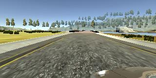
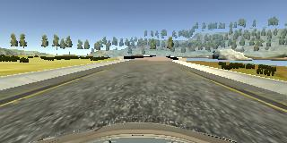
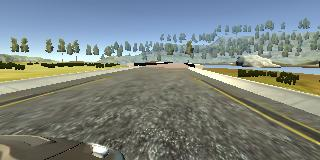
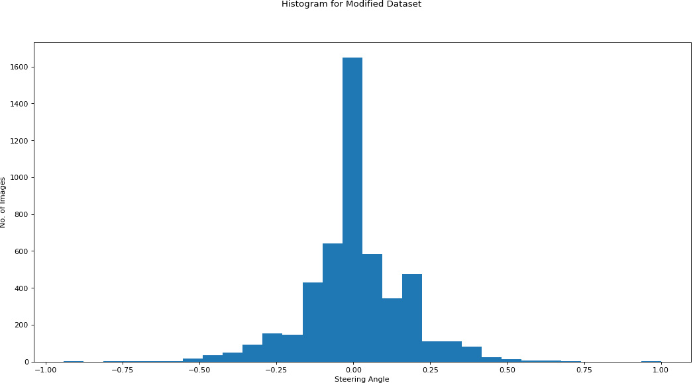
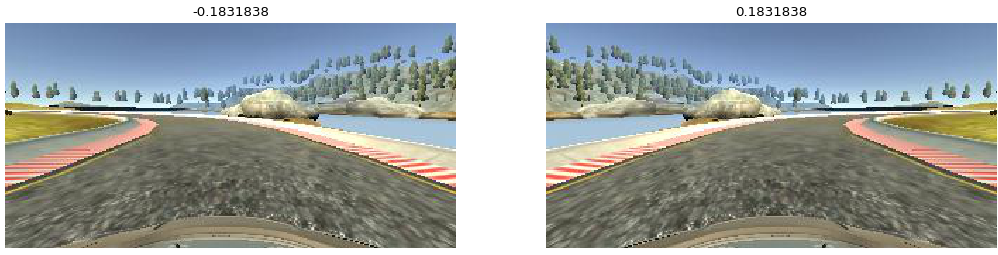
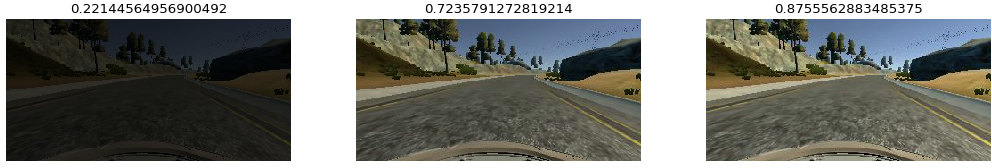
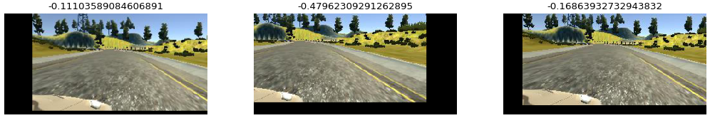

# **Behavioral Cloning**

### **Behavioral Cloning Project**

The goals for this project are the following:

* Use the simulator to collect data of good driving behavior
* Build, a convolution neural network in Keras that predicts steering angles from images
* Train and validate the model with a training and validation set
* Test to make sure model successfully drives around track one without leaving the road
* Summarize the results with a written report

---

### Prerequisites

* Keras 2 API
* Tensorflow Backend
* AWS GPU Instance for training data
* [NVIDIA's model](http://images.nvidia.com/content/tegra/automotive/images/2016/solutions/pdf/end-to-end-dl-using-px.pdf) for a working CNN model
* Udacity's Self Driving Car simulator

---

### Project Files & Folder Structure

This project includes the following files & folders

>
> model.py => CNN Model based on Keras 2 API
>
> model.h5 => Compiled model
>
> model.png => Keras model visualization
>
> drive.py => Original file from Udacity to drive autonomously in the simulator.  Not changed.
>  
> video.mp4 => YouTube Link [https://youtu.be/QxI3tvIn0Ms](https://youtu.be/QxI3tvIn0Ms)
>
> video.py  => Original file from Udacity. Not modified.

--


### Model Architecture and Training Strategy

#### 1. An appropriate model architecture has been employed

The model used here is completely based on [NVIDIA's paper](http://images.nvidia.com/content/tegra/automotive/images/2016/solutions/pdf/end-to-end-dl-using-px.pdf) with added Dropout layers between the fully connected layers.


#### 2. Attempts to reduce overfitting in the model

The model includes dropouts in between the fully connected layers and the number of epoch was set to 5 where the training saturates to avoid overfitting (model.py lines 21).

The model was trained and validated on different data sets - including driving the car in reverse in the simulator, driving data from Track 2 etc. The model was tested by running it through the simulator and ensuring that the vehicle could stay on the track.

The compiled model (model.h5) used for final submission was trained on Udacity's data with some filtering and preprocessing.

#### 3. Model parameter tuning

The model parameters were tuned or optimized by Adam optimizer with its defaults values

```
Keras 2 API Documentation

keras.optimizers.Adam(lr=0.001, beta_1=0.9, beta_2=0.999, epsilon=1e-08, decay=0.0)
```


#### 4. Appropriate training data

Managed collect quite a number of training data from the simulator also made attempts to do image preprocessing by cropping, mirroring, translating and shadowing the images.

### Model Architecture and Training Strategy

#### 1. Solution Design Approach

The original goal for this model architecture was to build a multi-layer convolutional network that can be trained and eventually used to autonomously drive the car in a simulator.

NVIDIA's end-to-end learning model for self driving car was a established working model that was proven to work in varied conditions. In this project I have made attempts to avoid overfitting by adding Dropouts to the existing model and added methods to improve the training data by preprocessing and image augmentation.

Though the simulator provides a variety of road conditions, the model is capable of learning and eventually driving on provided Track 1, infact this model was originally intended for real time conditions therefore it should perform much better in a simulated environment.

Keras 2 API provide nice features to split the data between training any validation. I have compiled the Keras model using "Mean Square Error" loss function and inbuilt **Adam** optimizer to optimize the models using default values, mentioned above.

```
model.compile(loss='mse', optimizer='adam')
```

At the end of the process, the vehicle is able to drive autonomously around the track without leaving the road.

#### 2. Final Model Architecture

The final model architecture (model.py, lines 98-133, function buildModel()) consisted of a convolution neural network with the following layers and layer sizes ...

```
_________________________________________________________________
Layer (type)                 Output Shape              Param #   
=================================================================
cropping2d_1 (Cropping2D)    (None, 76, 318, 3)        0         
_________________________________________________________________
lambda_1 (Lambda)            (None, 76, 318, 3)        0         
_________________________________________________________________
conv2d_1 (Conv2D)            (None, 38, 159, 24)       1824      
_________________________________________________________________
max_pooling2d_1 (MaxPooling2 (None, 37, 158, 24)       0         
_________________________________________________________________
conv2d_2 (Conv2D)            (None, 19, 79, 36)        21636     
_________________________________________________________________
max_pooling2d_2 (MaxPooling2 (None, 18, 78, 36)        0         
_________________________________________________________________
conv2d_3 (Conv2D)            (None, 9, 39, 48)         43248     
_________________________________________________________________
max_pooling2d_3 (MaxPooling2 (None, 8, 38, 48)         0         
_________________________________________________________________
conv2d_4 (Conv2D)            (None, 8, 38, 64)         27712     
_________________________________________________________________
max_pooling2d_4 (MaxPooling2 (None, 7, 37, 64)         0         
_________________________________________________________________
conv2d_5 (Conv2D)            (None, 7, 37, 64)         36928     
_________________________________________________________________
max_pooling2d_5 (MaxPooling2 (None, 6, 36, 64)         0         
_________________________________________________________________
flatten_1 (Flatten)          (None, 13824)             0         
_________________________________________________________________
dropout_1 (Dropout)          (None, 13824)             0         
_________________________________________________________________
dense_1 (Dense)              (None, 1164)              16092300  
_________________________________________________________________
dropout_2 (Dropout)          (None, 1164)              0         
_________________________________________________________________
dense_2 (Dense)              (None, 100)               116500    
_________________________________________________________________
dropout_3 (Dropout)          (None, 100)               0         
_________________________________________________________________
dense_3 (Dense)              (None, 50)                5050      
_________________________________________________________________
dropout_4 (Dropout)          (None, 50)                0         
_________________________________________________________________
dense_4 (Dense)              (None, 10)                510       
_________________________________________________________________
dense_5 (Dense)              (None, 1)                 11        
=================================================================
Total params: 16,345,719
Trainable params: 16,345,719
Non-trainable params: 0
_________________________________________________________________
```


#### 3. Creation of the Training Set

In my first attempt, I purposefully collected data by driving car in zig-zag manner hoping there will be more data points with non-zero steering angle and the model would strive to stick to the center always. However, I was proved otherwise as the car started to circle around continuously, as you see in the ](http://www.youtube.com/watch?v=XlR6suUvaVE)

Having a good dataset is very critical for training a neural network. To capture good driving behavior, I first recorded two laps on track one by strictly following center lane driving




I then recorded the vehicle recovering from the left side and right sides of the road back to center so that the vehicle would learn to swerve back to the center of the lane if it gets drifted. Below are some of of the samples.

[Swerve from Left](./images/swerve-from-left.mp4)

[Swerve from Right](./images/swerve-from-right.mp4)

I also have taken recommendations from attempted recommendations from [David](http://davidaventimiglia.com/carnd_behavioral_cloning_part1.html) on adjusting steering angles based on the type of image augmentation, for example, the left & right camera images were used for training with steering adjusted with a factor of +0.25 and -0.25 respectively.

#### 4. Dataset Preprocessing & Image augmentation

##### Dataset Cleanup

Below histogram shows the data distribution for the steering angle, it is very obvious that there is a very large number of sample for zero steering angle (0.0), when compared to the other values. We have have to trim the dataset to normalize the number samples across the steering angles.

[Histogram](./images/histogram_original_dataset.png)

> Udacity's Dataset
> Total samples 8037
> No. of samples with 0 steering angle 3675

I executed the below Shell command to randomly strip off data samples with 0 steering angle. Within the model bootstrap (model.py ln# 193, 194) I double the number of samples to increase the amount of training data. With random image augmentation the training will have a enough amount of varied samples.

```
awk '(NR>1) && (($4 != "0,") || (rand() < 0.3))' driving_log.csv > modified_driving_log.csv
```


> Modified Udacity's Dataset
>
> Total samples 4988
>
> Number of samples with 0 steering angle 1314
>
> Number of training samples : 7980
>
> Number of validation samples : 1996

Below is the data distribution for modified dataset, showing the reduced number of samples for 0 steering angles. Removing the data completely for 0-steering-angle seems to have a problem, for me, however there is still scope for reducing data.




##### Image Flipping

The data generator randomly flips images and adjusts the steering angle accordingly (model.py - ln# 162, ln# 90-95)

The steering angle is adjusted by multiplying by -1.




##### Image Shadowing

One of the image augmentation technique followed in this work is to increase or descrease the image brightness randomly to simulate shadowing on the streets.  (model.py - ln# 164, ln# 72-88)

Image shadowing does not impact steering angle.




##### Image Translation

Image translation is another technique where the image is slightly moved off of the axis.  (model.py - ln# 166, ln# 51-69)




##### Image Cropping (Using Keras Cropping2D)

Keras 2 API provides nice preprocessing methods in this model I have used Cropping2D API to crop the sample images. Based on few trial and error I crop 64 pixels from the top and 20 pixels from the bottom of the image. (model.py - ln# 110)

```
model.add(Cropping2D(cropping=((crop_top_pixels, crop_bottom_pixels), (1, 1)), input_shape=(160, 320, 3)))
```


Below is the recording from the working setup.


```
YouTube - video.mp4 - Click to play
```


=== [[video.mp4](http://img.youtube.com/vi/QxI3tvIn0Ms/maxresdefault.jpg)](http://www.youtube.com/watch?v=QxI3tvIn0Ms)
